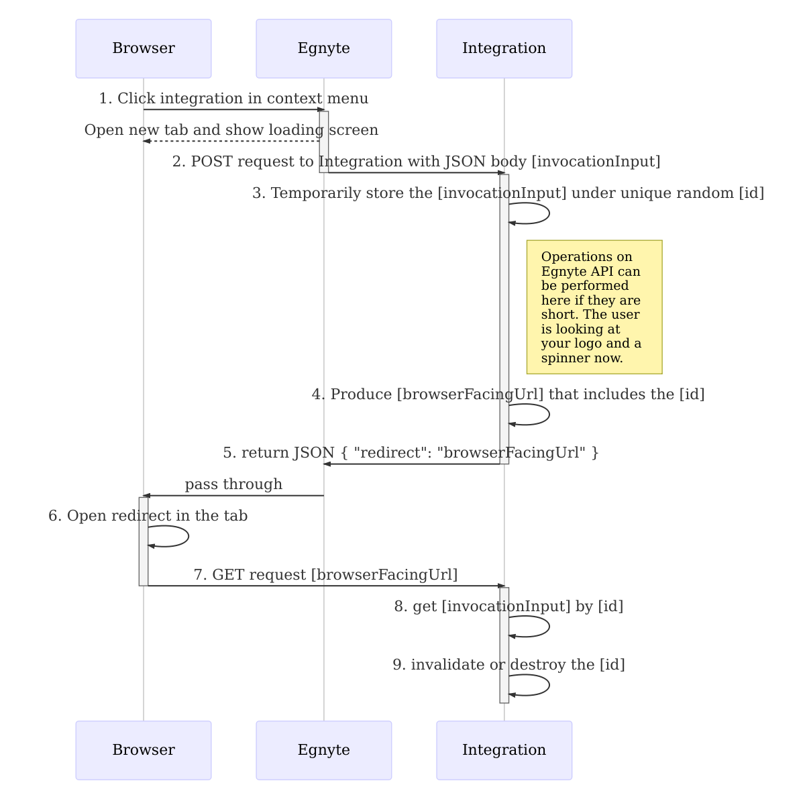
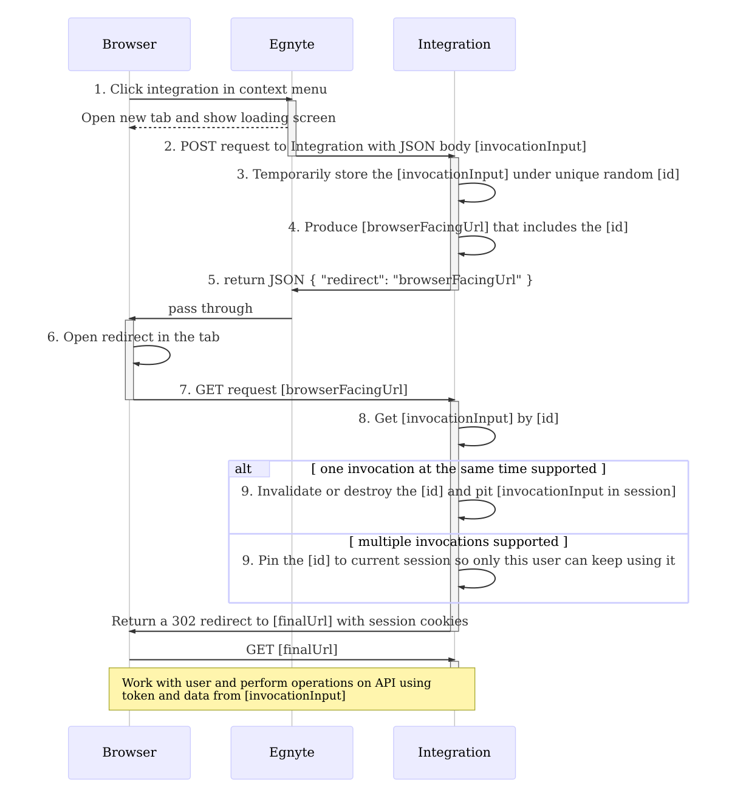
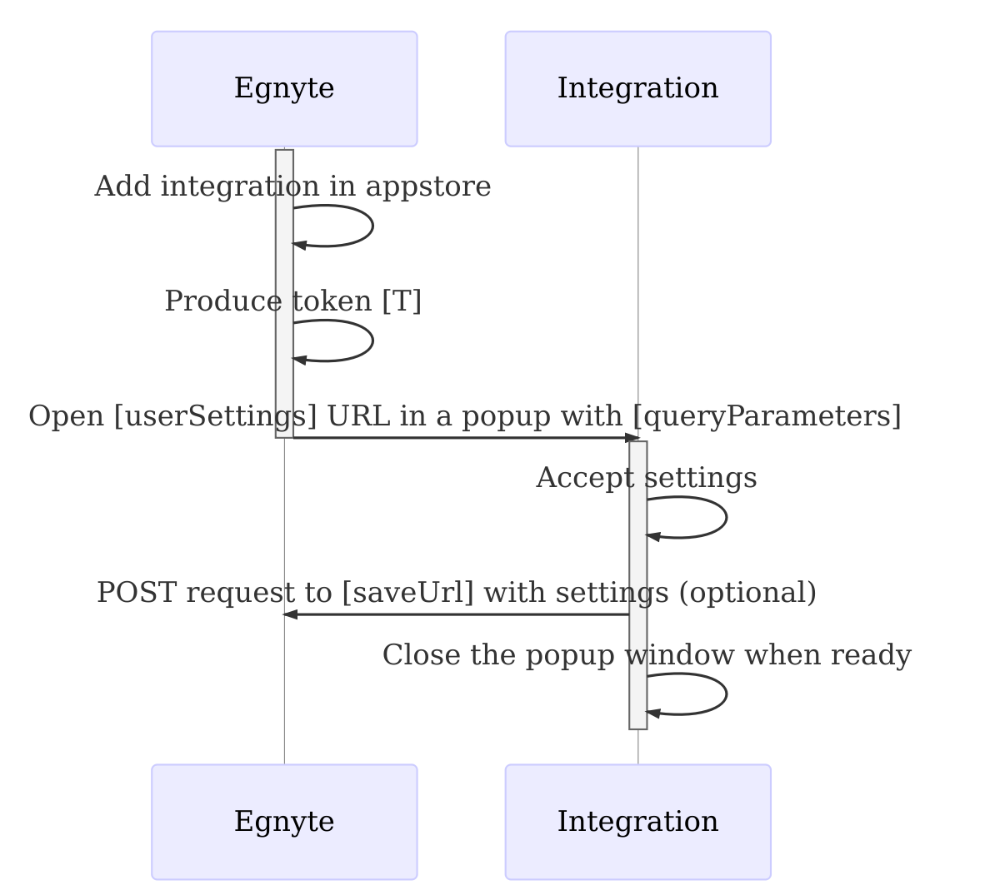

# UI Integration Framework

UI Integration Framework enables app developers to hook into the Egnyte Web UI to expose custom actions for their app. Currently, you can extend actions that can be performed on selected item(s) in the "More" menu and the Context menu. To get started with the UI Integration Framework, please contact partners@egnyte.com.

For a live demo of how UI Integrations work, try Example UI Integration app in your sandbox domain and see the [example app's code repository](https://github.com/egnyte/example-UIntegration)

# UI Integration Framework Invocation flow

When a user clicks on a button you've exposed, Egnyte server will send a POST request to your application's server with `invocationInput` containing the items that were selected and a token to access the Public API to work on those items. It expects a URL to open in the browser tab.

## Basic flow of the invocation




## Suggested steps to ensure invocation is securely handled



### invocationInput

```js
{
    "items": [
        {<storage item object that user selected>},
        ...
    ],
    "userInfo": {
        "id": 1,
        "first_name": "John",
        "last_name": "Doe",
        "username": "jdoe"
    },
    "domain": "acme.egnyte.com",
    "token": "public API token",
    "config": <settings saved via userSettings screen combined with globalSettings>,
    "configSaveUrl": <saveUrl>,
    "configSaveToken": <T>
}
```

Contents of `invocationInput` are sent to your app by Egnyte back-end to prevent them from passing throught the browser. Please make sure the `redirect` doesn't refer to them directly and they are not stored in cookies or localStorage.

configSaveUrl and configSaveToken can be used to update settings if necessary. For more context on them see Settings flow below.

**Example storage items**

Items may contain additional fields not listed here. Only the documented fields can be depended upon.

folder
```js
{
    "name": "Actual docs!",
    "path": "/Shared/Actual docs!",
    "folder_id": "d0dfb688-cded-4349-a665-86e9ae73950e",
    "is_folder": true
}
```

file
```js
{
    "checksum": "bd15746eb77624e29479b65b84c62f4d025dccd72a8c481367c31cf8364d74fbde1e8f5aee1ab118d5dfaab723f6f70e3f360d5ae8cf89a88bc13685a5e15927",
    "size": 539803,
    "path": "/Shared/Documents/document.pdf",
    "name": "document.pdf",
    "locked": false,
    "is_folder": false,
    "entry_id": "5c395049-1944-4707-a5c7-a824ab214c76",
    "group_id": "d6856efe-326d-4f7e-b2c3-e528b47f0b33",
    "last_modified": "Tue, 30 Aug 2016 14:10:57 GMT",
    "uploaded_by": "someusername",
    "num_versions": 1,
    "num_notes": 0
}
```

### browserFacingUrl

A one time use URL that contains an ID pointing to an invocationInput.
browserFacingUrl should expire in 2 to 5 minutes.

### finalUrl

A URL that is provided to the user with the UI for the application.

If one user session should be able to work with multiple invocations in separate tabs, make sure the finalUrl contains an ID pointing to invocationInput

The ID should only work for the user session that owns it.


## Assumptions you should make

1. When the user opens the tab with integration, they may leave it open for a day and come back to it. Handle that or prepare to display a nice screen to them telling the user to open it again.

2. Assume every invocation gets a different token. They match currently, but if you store one token and ignore others, you will get into trouble later. The tokens will get scoped to files/folders in single invocation.

3. Users will try to open more than one tab with integration. Handle this nicely even if you want them to only use one at the time. You can close the previous one or handle both.

4. Creating a new file will send you an item just like regular context menu invocation, but pointing to the new empty file. 

## Notify Egnyte of Changes (Optional)

While the app is open, it can communicate with Egnyte's Web UI using three events: completion, error, and refresh. For more information on sending events, please refer to [this section](https://github.com/egnyte/egnyte-js-sdk/blob/master/src/docs/uintegrate.md) of the JavaScript SDK.


# UI Integration Framework Settings flow

## User Settings and Global Settings
There are two types of settings which have the same saving flow, but differ with the type of user that can invoke the saving flow. Both flows are optional and only triggered if the corresponding Url (userSettings or globalSettings) is set in the definition.json. Egnyte generates a one-time use token and opens userSettings or globalSettings Url in a pop-up. Your application can then make a POST request to saveUrl provided. Egnyte saves the user  and globals settings data and sends these back combined with every invocation

User Settings are individual for each user using your integration. User Settings flow occurs when a user installs the integration app and choose to configure it. This flow is often used to save a user's authentication token.

Global Settings are common for a domain in which an administrator installs the integrations. Global Settings flow occurs when an administrator installed the integration and choose to configure it. The flow is often used to save domain specific URLs linking with other websites or integrations.

## Flow


When a user or admin choose to configure your application, Egnyte produces a one-time use token, T, and opens the userSettings or globalSettings Url (defined in definition.json) in a new tab with the token appended to the Url.

Your application handles the GET request and lets the user od administrator provide his or her settings for your application. Your application sends a POST request to saveUrl with a JSON body that includes the token and data containing the settings.

### userSettings
`userSettings` is a field from definition.json
User Settings flow is only opened if the field exists.
`userSettings` is expected to be a valid URL without query parameters.

### globalSettings
`globalSettings` is a field from definition.json
Global Settings flow is only opened if the field exists.
`globalSettings` is expected to be a valid URL without query parameters.

### queryParameters
Query parameters appended by the appstore to settings URL are as follows:
```
?domain=acme.egnyte.com&token=T&save_url=saveUrl
```

### POST to saveUrl
Sending a POST to `saveUrl` saves settings and they will be sent to the app on every invocation. If user cancels, the app remains installed and it needs to prompt for settings on invocation if necessary.

Token `T` is invalidated after a single request and can't be used anymore.

POST body:
```js
{
  "token": T,
  "data": {
    <key:value map of user settings>
  }
}
```


# Resolving branded domains

To resolve a domaain with branding:

- user inputs a `domain`
- check if domain is `somename.egnyte.com` if it is not, proceed
- make a GET request to `domain`/rest/public/1.0/env-pub to receive JSON
- read `workgroup.name` field from the response
- use `workgroup.name`.egnyte.com as egnyte domain to access public API
